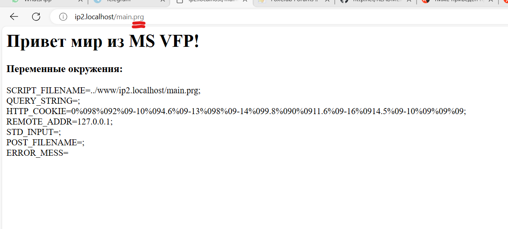
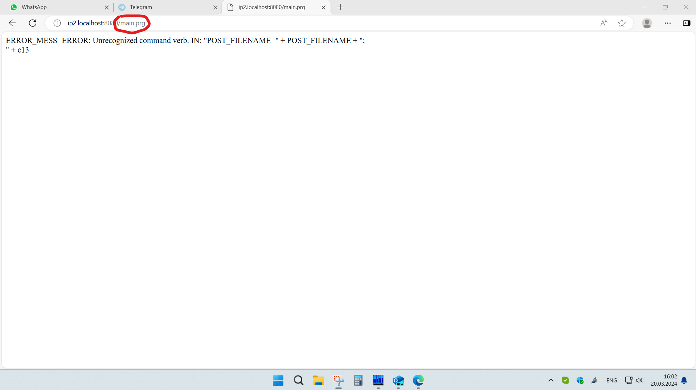

# http.net
Multithreaded http.net server on C#.  

The root folder for domains (by default www) must contain folders that match the domain name and subdomain of the requested resource. For example, if the request looks like http://a.kornienko.ru , then there should be a folder named in the root folder for domains a.kornienko.ru. If you need to provide aliases with other names, then you can create a folder in the root folder as a symbolic link to another folder.  

The number of threads should not be set immediately to the maximum possible. If the values are very high, the operating system may block the server operation. In my case, the maximum value at which the server is running steadily turned out to be exactly 1000. The default is 888. You can check how quickly threads are initialized by using the log, which indicates the timestamps of the server startup and the readiness of tasks to receive requests.  

Processing of wsf scripts with a handler is provided cscript.exe. In the http server parameters, you can replace this script extension and handler with any other one. It also provides processing of prg scripts via COM MS technology with VFP 9/10(Advanced) DBMS, not CGI. COM objects are created as requests from simultaneously accessing clients are made to the maximum value specified in the server parameters. By default, the visual error output of the VFP 9/10(Advanced) DBMS is disabled. In case of an error in the prg, the description of this error is returned to the script in the ERROR_MESS variable. Below is an example of a prg file and the result of its work. And also the result of a similar prg file, but with an error (the last line break ";" is missing).
```
D:\work\httpd>http.net /?
Многопоточный http.net сервер версия 2.13, (C) kornienko.ru июнь 2024.

ИСПОЛЬЗОВАНИЕ:
    http.net [Параметр1 Значение1] [Параметр2 Значение2] ...

    При необходимости указываются пары Параметр и Значение. Если значение текст и содержит
    пробелы, то его необходимо заключать в кавычки.

Параметры:                                                          Значения по умолчанию:
     -d      Папка, содержащая домены.                                        ../www/
     -i      Главный документ в папках. Главный документ в папке, заданной    index.html
             параметром -d используется для отображения страницы с кодом
             404 - файл не найден. Для сжатия трафика поддерживаются файлы,
             сжатые методом gzip вида имя.расширение.gz, например -
             index.html.gz или library.js.gz и т.д.
     -p      Порт, который прослушивает сервер.                               8080
     -b      Размер буферов чтения и записи.                                  16384
     -s      Количество одновременно обрабатываемых запросов. Максимальное    888
             число ограничивается только производительностью процессора и
             размером оперативной памяти.
     -q      Количество дополнительных запросов, хранящихся в очереди,        888
             если превышено количество поступивших одновременно запросов,
             заданных параметром -s. Если сумма обрабатываемых и ожидающих
             в очереди запросов будет превышена, то клиенту посылается
             отказ в обслуживании.
     -cp     Номер кодовой страницы, используемый для передачи текста.        1251
     -db     Максимальное количество динамически запускаемых экземпляров      22
             СУБД VFP. Расширение скриптов для запуска СУБД - prg. Процессы
             запускаются по мере одновременного обращения клиентов до
             заданного значения.
     -log    Размер журнала регистрации запросов в строках. Журнал состоит    10000
             из двух чередующихся версий http.net.x.log и http.net.y. Если
             задан размер менее 80, то журнал не ведётся.
     -less   Максимальный размер небольших файлов, которые должны             524288
             кешироваться. Все такие файлы при обращении к ним для повышения
             производительности будут сохраняться в оперативной памяти.
     -post   Максимальный размер принимаемого запроса для передачи            33554432
             файлу-скрипту. Если он будет превышен, то запрос помещается в
             файл, имя которого передается скрипту в переменной окружения
             POST_FILENAME. Другие формируемые переменные окружения -
             SCRIPT_FILENAME, QUERY_STRING, HTTP_COOKIE, REMOTE_ADDR. Если в
             данных запроса отсутствует директива form-..., то входящий
             поток данных целиком будет помещен в файл. Эта особенность
             может использоваться для передачи серверу файлов. При этом имя
             файла будет находиться в переменной окружения POST_FILENAME.
     -proc   Используемый оброботчик скриптов. Если нобходимо, то нужно       cscript.exe
             также включить полный путь к исполняемому файлу. По умолчанию
             используется встроенный в ОС Microsoft Windows компонент,
             очень быстрый обработчик - сервер сценариев (WSH), использующий
             языки JScript и VBScript.
     -args   Дополнительные параметры командной строки запуска оброботчика.
             При использовании cscript.exe в случае, если дополнительные
             параметры не заданы, используется параметр //Nologo.
     -ext    Расширение файлов-скриптов.                                      wsf
```
Корневая папка для доменов (по умолчанию www) должна содержать папки, соответствующие доменному имени и поддомену запрашиваемого ресурса. Например, если запрос выглядит как http://a.kornienko.ru , то в корневой папке для доменов должна быть папка с именем a.kornienko.ru. Если вам нужно предоставить псевдонимам другие имена, вы можете создать папку в корневой папке в качестве символической ссылки на другую папку.  

Число потоков не следут задавать сразу максимально возможным. При очень больших значениях операционная система может заблокировать работу сервера. В моем случае максимальное значение при котором сервер работает устойчиво оказалось ровно 1000. По умолчанию — 888. Проверить, как быстро иницилизируются потоки можно по журналу, в котором указываются метки времени запуска сервера и готовности задач к приему запросов.  

Предусмотрена обработка wsf-скриптов с помощью обработчика cscript.exe. В параметрах http-сервера вы можете заменить это расширение скрипта и обработчик на любое другое. Он также обеспечивает обработку prg-скриптов по технологии COM MS с использованием СУБД VFP 9/10(Advanced), а не CGI. COM-объекты создаются по мере выполнения запросов от клиентов с одновременным доступом к максимальному значению, указанному в параметрах сервера. По умолчанию визуальный вывод ошибок в СУБД VFP 9/10(Advanced) отключен. В случае ошибки в prg описание этой ошибки возвращается скрипту в переменной ERROR_MESS. Ниже приведен пример файла prg и результат его работы. А также результат работы с аналогичным файлом prg, но с ошибкой (отсутствует разрыв последней строки ";").
```
* * * * * * * * * * * * * * * * * * * * * * * * * * * 
*  Тест. Вывод переменных окружения.
* * * * * * * * * * * * * * * * * * * * * * * * * * * 
  stdout=""
  c13=chr(13)+chr(10)
  stdout="<h1>Привет мир из MS VFP!</h1>" + ;
         "<h3>Переменные окружения:</h3>" + ;
         "SCRIPT_FILENAME=" + SCRIPT_FILENAME + ";<br>" + c13 + ;
         "QUERY_STRING=" + QUERY_STRING + ";<br>" + c13+ ;
         "HTTP_COOKIE=" + HTTP_COOKIE + ";<br>" + c13 + ;
         "REMOTE_ADDR=" + REMOTE_ADDR + ";<br>" + c13 + ;
         "STD_INPUT=" + STD_INPUT + ";<br>" + c13 + ;
         "POST_FILENAME=" + POST_FILENAME + ";<br>" + c13
  stdout= stdout + "ERROR_MESS=" + ERROR_MESS
return c13+stdout
```
The visual result of the prg script:


If there is an error in the prg file:

### История версий
В папке httpd всегда можно скачать последнюю рабочую версию: http.net.exe.  
  
1.0. Январь 2023. Первая версия.  
1.1. Февраль 2023. По рекомендации MS Corp. убраны массивы с динамически изменяющимися размерами в целях уменьшения нагрузки на системный сборщик мусора в ОП. Добавлено кэширование небольших файлов с целью увеличения скорости работы сервера.  
1.2. Апрель 2023. Реализовано сохранение буферов журнала запросов при бездействии сервера в течении 3 с.  
1.3. Май 2023. Исправлена ошибка буферизации при кешировании небольших файлов.  
1.4. Ноябрь 2023. При отсылке результата скрипта теперь не отсылается заголовок длины этого результата и не закрывается блок заголовков в целях соблюдения приемственности известных http-серверов, например такого, как Apache.  
1.5. Январь 2024. Добавлена переменная окружения SCRIPT_FILENAME.  
1.6. Январь 2024. Исправлена ошибка кодировки при скачивании файлов через пользовательские скрипты.  
1.7. Февраль 2024. Устранено исключение, появляющееся при закрытии сервера.  
1.8. Март 2024. Добавлено чтение имени файла из заголовка вида Content-Disposition: attachment; filename="filename.jpg" (Используется при загрузке файлов методом POST).  
1.81. Март 2024. Ужесточена безопасность. Клиент сможет делать запросы к ресурсам только в пределах папки с доменом/поддоменом и только к файлам с разрешенными расширениями. Добавлена возможность использования СУБД MS Foxpro 9/10(Advanced) через COM технологию с расширением скриптов — prg.  
1.82. Март 2024. Убран концевой перевод строки после возвращаемых данных пользовательских скриптов.  
1.83. Март 2024. Добавлено использование кодовой страницы конфигурации СУБД VFP при возвращении результата prg файла.  
1.9. Апрель 2024. Добавлен параметр используемой сервером кодовой страницы -cp для обработки текстовых потоков.  
1.91. Апрель 2024. Добавлено немного больше асинхронности между сессиями.  
1.92. Апрель 2024. Увеличена стабильность существования потоков сессий.  
1.93. Апрель 2024. Заменён класс асинхронного цикла верхнего уровня, порождающего потоки, на класс параллельного выполнения.  
1.94. Апрель 2024. Увеличено число рабочих потоков. Запмсь в журнал переведена в отдельный поток с меньшим приоритетом.   
1.95. Апрель 2024. Число рабочих потоков увеличено до максимума, до значения, заданного параметром -s. При этом контроль правильности задания этого параметра ложится на пользователя путем анализа журнала, где первые две записи фиксируют время запуска сервера и время инициализации задач.  
2.0-2.1. Май-июнь 2024. Оптимизация кода.  
2.11-2.12. Июнь 2024. Обработка случая разрыва связи с клиентом.  
2.13. Июнь 2024. Теперь переменная окружения SCRIPT_FILENAME содержит полный путь к скрипту.  
