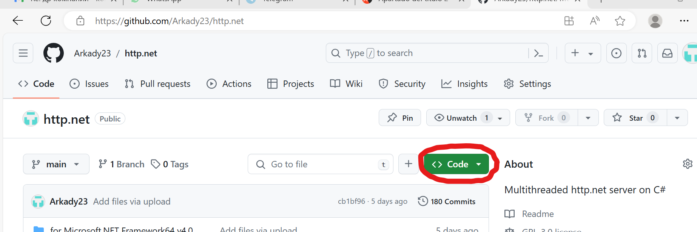

Http-сервер рекомендуется использовать в двух вариантах:
- для отладки, когда вы еще не разработали окончательные варианты скриптов;
- для основного применения, когда разработанные скрипты готовы.

Сервер предусматривает выполнение в качестве скриптов prg-файлов, связь с которыми осуществляется через технологию MS COM. Также по умолчанию сервер выполняет wsf-скрипты подсистемы MS WSH, присутсвующей в любой версии Windows. В параметрах запуска http-, а также https- серверов вы можете изменить обработчик по умолчанию cscript.exe на любой другой, которому вы по тем или иным причинам отдаете предпочтение.

Классические серверные скрипты обычно формируют текстовый html-файл и возвращают его клиенту. Однако в современном мире с целью уменьшения интернет-трафика скрипты, расположенные на сервере, передают только необходимые данные.  При такой технологии само формирование, а точнее сказать — модификация открытого html файла, обеспечивается с помощью javascript, работающего в обозревателе на стороне клиента. При этом страница обозревателя получает динамичность и непрерывность и может не отличатся от настольного приложения. Передаваемые скриптом данные в таком случае могут представлять собой произвольный текст, структуру которого определяет сам разработчик. Я, например, предпочитаю передавать данные в виде полей с разделителями табуляции.
## Загрузка http- и https- серверов с github.com
Для того, чтобы загрузить всё необходимое, нужно зайти по ссылке https://github.com/Arkady23/http.net и нажать на выделяющуюся зеленую кнопку с надписью “<> Code”, как показано на скриншоте: 

Далее выбрать и нажать на пункт меню “Download ZIP”.

Обычно, если я доверяю скаченному документу, который сам разместил, открываю на скаченном файле свойства, выбираю галочку “Разблокировать” и подтверждаю “Ok”.

В скаченном архиве нас интересуют две папки: httpd и www. Эти папки нужно скопировать в любую вашу папку, где вы планируете разместить http-сервер и корневую папку с сайтами www. В моем случае это папка D:\work\. В приложении указаны относительные пути, поэтому главное, чтобы папки http и www располагались рядом в одной папке.
