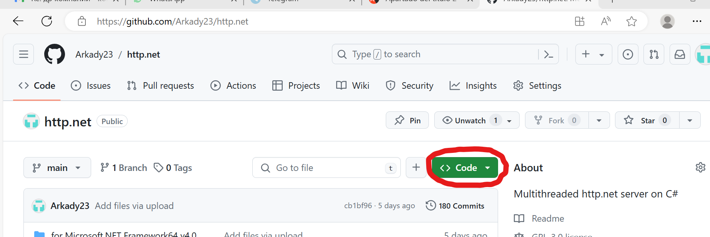

# Руководство пользователя
### Быстрые ссылки
[Введение](#Введение)  
[Загрузка серверов с github.com](#загрузка-http--и-https--серверов-с-githubcom)  
[Использование http-сервера для отладки скриптов](#использование-http-сервера-для-отладки-скриптов)  
[Использование серверов по основному назначению](#использование-сервера-по-основному-назначению)  
[Безопасность](#безопасность)  
[Пример prg "Привет мир с переменными окружения"](#вывод-документа-привет-мир-с-переменными-окружения)  
[Пример prg "Привет мир" с формированием html на стороне клиента](#пример-формирования-html-страницы-с-данными-из-prg-на-стороне-клиента)  
[Пример prg с реализацией алгоритма двумерной интерполяции](#онлайн-пример-работы-алгоритма-двумерной-интерполяции)  
[Пример prg из реального сайта ТСЖ](#пример-prg-из-реального-сайта-тсж)  
[Пример prg, предоставляющего API-сервис](#пример-prg-предоставляющего-api-сервис)  
## Введение
Http-сервер предусматривает выполнение в качестве скриптов prg-файлы СУБД MS VFP9/VFPA, связь с которыми осуществляется через технологию MS COM. Также по умолчанию сервер выполняет wsf-скрипты подсистемы MS WSH, присутсвующей в любой версии Windows. В параметрах запуска http-, а также https- серверов вы можете изменить обработчик по умолчанию cscript.exe на любой другой, которому вы по тем или иным причинам отдаете предпочтение — на популярный php или на современный "dotnet fsi", выполняющий скрипты с расширением fsx, написанные на F#. Тем не менее Microsoft по настоящее время поддерживает WSH как в 32-х битной, так и в 64-х битной версиях.

Классические серверные скрипты обычно формируют текстовый html-файл и возвращают его клиенту. Однако с целью уменьшения интернет-трафика скрипты, расположенные на сервере, могут передавать только необходимые данные, а их дальнейшую обработку переложить на ПО клиента.  Формирование или модификацию открытого html файла на основании полученных с сервера данных может осуществлять javascript, работающий в обозревателе на стороне клиента. При этом страница обозревателя получает динамичность и непрерывность и может не отличатся от настольного приложения. Передаваемые скриптом данные в таком случае могут представлять собой произвольный текст, структуру которого определяет сам разработчик. Я, например, предпочитаю передавать данные в виде полей с разделителями табуляции.
## Загрузка http- и https- серверов с github.com
Для того, чтобы загрузить всё необходимое, нужно зайти по ссылке https://github.com/Arkady23/http.net и нажать на выделяющуюся зеленую кнопку с надписью "<> Code", как показано на скриншоте: 

Далее выбрать и нажать на пункт меню “Download ZIP”.

Обычно, если я доверяю скачанному документу, который сам разместил, открываю на скачанном файле свойства, выбираю галочку "Разблокировать" и подтверждаю "Ok".

В скачанном архиве нас интересуют три папки: httpd.last, https.last и www&#8203;. Эти папки нужно скопировать в любую вашу папку, где вы планируете разместить http- https- серверы и корневую папку с сайтами www&#8203;. В моем случае это папка D:\work\. В приложении указаны относительные пути, поэтому главное, чтобы папки http.last, https.last и www располагались рядом. Вы можете переименовать папки http.last и https.last на любые другие имена, которые вам нравятся, например на http.net и https.net.

Для https-сервера необходимо наличие pfx-файла, который представляет собой незащищенный паролем архив криптографических компонентов, предназначенных для передачи данных по протоколу TLS-1.2. Имя вашего pfx-файла необходимо указать в параметре -c запуска https.net.exe. Если вы не указываете путь к файлу pfx, то он ищется в папке с самой программой https.net.exe либо в корневой папке для доменов, в нашем случае это www&#8203;.
## Использование http-сервера для отладки скриптов
После того как вы скачали и разместили требуемые папки где-то у себя на диске, вам нужно в терминале с вашей учетной записью найти и запустить без параметров файл http.net.exe.

По умолчанию без параметров для отладки скриптов сервер использует порт 8080. При желании вы можете указать свой номер порта, добавив в командную строку, например для использования порта 8081, текст "-p 8081". Сразу же после запуска защитник Windows выведет экран с запросом о разрешении доступа сервера к общедоступным сетям. Чтобы потом не искать где и что нужно изменить в брандмауэре, сразу дайте такое разрешение.

Для проверки работоспособности сервера, наберите в обозревателе адрес http://localhost:8080. Обозреватель может добавить к домену localhost поддомен www и поэтому сервер в корневой папке www не найдет папку с именем <span>ww</span>w.localhost, т.к. в дистрибутиве предусмотрена только папка localhost. В этом случае, находясь в текущей папке D:\work\www&#8203;, вы можете создать твердую ссылку <span>ww</span>w.localhost на папку localhost командой `mklink /D www.localhost localhost`. Для выполнения команды mklink могут потребоваться права администратора. Обозреватель должен что-то показать&nbsp;— одну из двух находящихся страниц в папке www&#8203;. Обратите внимание, что страница index.html.gz в папке www сжата. Это нормально, распаковывать её не надо. Для экономии трафика сервер передает клиенту такие сжатые страницы, а также сжатые js-, css- и любые другие сжатые текстовые файлы.  

Сервер имеет иконку в трее, через которую можно вызвать контекстное меню или двойным кликом по иконке отобразить параметры сервера. Если параметры сервера вы задаете через текстовый файл, вы можете изменить его и через контекстное меню перезапустить сервер для обновления используемых параметров.
## Использование серверов по основному назначению
Когда у вас все ваши скрипты отлажены. По крайней мере, вы так думаете. Вы захотите, чтобы ваш ПК включался с запущенным http и/или https сервером/серверами и использовал порт 80/443. Для этого под административной учетной записью вы входите в планировщик заданий, например с помощью командной строки `taskschd.msc`. После запуска планировщика, вы выбираете пункт меню "действие/создать задачу". Запускается мастер создания заданий, в котором вы указываете, что задание выполняется от учетной записи администратора для всех пользователей. Если вы укажете обычную учетную запись пользователя, то при добавлении триггера у вас не будет опции запуска задания при запуске Windows. Далее во вкладке Триггеры, вы создаете триггер и указываете, что задачу нужно начать при запуске Windows, т.е. при включении ПК. Во вкладке Действия вы указываете, что вам нужно запустить программу, в нашем примере: D:\work\httpd.last\http.net.exe с аргументом "-p 80". Дополнительно во вкладке Параметры нужно установить флажок "Выполнять задачу по требованию", "При сбое выполнения перезапустить через 1 минуту" и убрать флажок "Остановить задачу, выполняемую дольше". Далее, когда созданное вами задание появится в списке заданий, вы выделяете ваше задание и нажимаете на иконку зеленого треугольника, что означает Выполнить. Всё! Сервер запущен и будет запускаться вместе с Windows и ожидать запросы на порту 80.
## Примеры
Ниже приводятся примеры серверных prg-скриптов для СУБД MS VFP, однако принципиальной разницы в использовании того или иного языка программирования нет.
### Вывод документа Привет мир с переменными окружения
В папке localhost мы создаем test.prg следующего содержания:
```
* * * * * * * * * * * * * * * * * * * * * * * * * * * 
* Тест. Вывод переменных окружения.
* * * * * * * * * * * * * * * * * * * * * * * * * * * 
  c13 = chr(13) + chr(10)
  STD_INPUT = _Screen.STD_IO.value
  _Screen.STD_IO.value = 'Content-Type: text/html; charset="utf-8"' + c13 + c13
  _Screen.STD_IO.value = _Screen.STD_IO.value + ;
         "<h1>Привет мир из MS VFP!</h1>" + ;
         "<h3>Переменные окружения:</h3>" + ;
         "SCRIPT_FILENAME=" + SCRIPT_FILENAME + ";<br>" + c13 + ;
         "QUERY_STRING=" + QUERY_STRING + ";<br>" + c13+ ;
         "HTTP_COOKIE=" + STRE(HTTP_HEADERS,"Cookie:",c13) + ";<br>" + c13 + ;
         "REMOTE_ADDR=" + REMOTE_ADDR + ";<br>" + c13 + ;
         "STD_INPUT=" + STD_INPUT + ";<br>" + c13 + ;
         "POST_FILENAME=" + POST_FILENAME + ";<br>" + c13
  _Screen.STD_IO.value = _Screen.STD_IO.value + "ERROR_MESS=" + ERROR_MESS
```
Страница по адресу http://localhost:8080/test.prg будет корректно отображаться в национальной кодировке. Так же может отобразится ошибка, что у вас в системе не зарегистрирован MS VFP COM. В этом случае вам надо зарегистрировать желаемую версию VFP, например VFPA.EXE, командой “VFPA.EXE /regserver”, для которой также требуются права администратора.  

Обратите внимание, что первой строкой идет заголовок, показывающий тип передаваемого далее содержимого. В общем случае у вас может быть несколько заголовков, которые должны заканчиваться пустой строкой — это требование протокола http. Пустая строка, а точнее возврат каретки и перевод строки, означает конец строк с заголовками.  

Для более эффективного использования стандартного ввода-вывода используйте функции, приведенные в примере на главной странице.  
### Безопасность
Заголовком может быть строка куки. Куки разумно использовать для обеспечения безопасности работы в сети интернет. Для этого в куку помещают зашифрованную строку, используя выбранный вами метод шифрования. Здесь весьма разумно передавать логин пользователя. Использовать слишком длинные куки не разумно, т.к. они имеют свойство прикрепляться к каждому запросу и могут излишне нагружать трафик. С другой стороны это свойство очень полезно для защиты от несанкционированного запроса. Т.к. каждый запрос будет сопровождаться зашифрованным логином, каждый скрипт может перед тем, как выполнить задание, расшифровать и проверить поступивший логин.  
Тема шифрования, это отдельная тема, у которой есть некоторые важные аспекты. Как говорят знающие взломщики замков: самый сложный замок — это замок, изготовленный индивидуально в единичном экземпляре, всё остальное взламывается проще. Поэтому создание индивидуального метода шифрования, на мой взгляд лучше каких-либо общепринятых методов. В простейшем случае вы можете переставить какие-то символы или как-то по своему преобразовать логин, чтобы злоумышленник, получив куки, не смог увидеть полезную информацию. К вашему методу по аналогии с замком может быть ключ, который тоже надо как-то скрытно передавать, например фоном, а может и по частям, каждая часть из которых по своему может быть зашифрована. В особо важных случаях надо понимать, что протокол https предполагает наличие ключей у третьих лиц, тех, кто выдает эти ключи.
### Пример формирования html страницы с данными из prg на стороне клиента
Как уже говорилось выше, на стороне клиента используется javascript. Ссылка на файл javascript, например test.js помещается в тег html script: “<script src='test.js'></script>”.  
Для начала работы на javascript я использую функцию: “go('test.prg')”. Это асинхронная функция, она выполняется параллельно с основным процессом.  
Другая функция javascript, которую я использую — “go2()”, получает управление после поступления результата из test.prg.  
В реальной задаче у вас может быть не единственный prg файл, поэтому каждая возвращаемая строка должна себя идентифицировать и однозначно определять для какой функции она передает результат. Например, в первом поле в возвращаемой строке или в нескольких фиксированных символах, можно передавать название функции, для которой этот результат предназначается.  
Далее приводятся тексты упомянутых файлов, выполняющихся на стороне клиента в кодировке, принятой в стандартах для html по умолчанию — UTF-8.  
Файл test.html:
```
<!DOCTYPE html>
<html lang="ru">
<head>
<meta name="viewport" content="width=device-width, initial-scale=1">
<script src="test.js"></script>
</head>
<body id="result_prg">
<script>go("test.prg")</script>
</body>
</html>
```
Здесь тег meta мы добавляем, чтобы наша страница нормально отображалась на смартфонах.  
Файл test.js:
```
async function go(url2){
  var d=""; // пример без использования входных данных
  try{
    req=await fetch(url2,{
        method:'POST', headers:{'Content-Type':
        'application/x-www-form-urlencoded'},
        body: encodeURIComponent(d)
      })
    if(req) if(req.ok){
      go2();
    }else{
      alert("Не удалось получить данные: "+req.statusText);
    }
  }catch(e){
    alert("Невозможно передать данные: "+e.message);
  }
}
async function go2(){
  responseText = await req.text()
  document.getElementById("result_prg").innerHTML= responseText
}
```
Для выполнения этого примера в папке localhost должно быть три файла — test.html, test.js и test.prg.  Первые два файла, загружаются в обозреватель клиента, и только последний выполняется сервером. Запускаем http.net.exe без параметров и в обозревателе набираем адрес http://localhost:8080/test.html. Видим, что страница формируется так, как нами было задумано.
### Онлайн пример работы алгоритма двумерной интерполяции
На странице с помощью javascript формируется расширяющаяся в процессе ввода данных таблица. Изначально она заполнена произвольными значениями. Программа ip21.prg производит расчет промежуточных точек методом двумерной интерполяции и формирует текстовую строку, содержащую количество исходных точек, сами координаты исходных точек и массив координат рассчитанных точек. Исходные точки по нажатию на клавишу "Раcсчитать" также сохраняются в куку на 1 месяц для того, чтобы при следующем посещении страницы не пришлось набирать эти данные снова. Вообще сохранять большие данные в куку не желательно, чтобы не создавать большой избыточный трафик. Лучше передавать данные на сервер методом POST и хранить их в dbf или текстовом файле. Но такой вариант не рассматривается, т.к. для него нужно будет осуществлять авторизацию клиента, и программа на VFP значительно увеличится в размере.  
Тексты файлов, используемые на стороне клиента index.html, o.css, s.js и o.js, можно просмотреть в режиме онлайн. Ниже приведен файл ip21.prg, работающий на стороне сервера. Этот алгоритм можно было бы также реализовать на стороне клиента на javascript, но код написан для VFP или VFPA в целях демонстрации работы сервера http.net или https.net. Также алгоритмы можно помещать в prg файлы по другим причинам, например, чтобы скрыть от просмотра клиентом текст программы. Файл ip21.prg вызывается со страницы клиента через javascript функцей go('/ip21/ip21.prg'), где /ip21/ — это папка в каталоге с файлами сайта.
```
*
*   Two-dimensional interpolation through specified points based on
*   the geometric principles of Bezier 
*   ^^^^^^^^^^^^^^^^^^^^^^^^^^^^^^^^^^^^^^^^^^^^^^^^^^^^^^^^^^^^^^^^
*   Author: Arkady B. Kornienko
*   Date:   18.07.2024
*
  ** Чтение и контроль данных
  ** Reading and controlling data
  ** Lectura y control de datos
  stor 0 to dx,n
  c13=chr(13)+chr(10)
  c9=chr(9)
  j=alin(d,STRE(HTTP_HEADERS,"Cookie:",c13),"%09")
  if m.j>1
    for i=1 to m.j
      if empt(rtri(d[m.i])) or empt(rtri(d[m.i+1]))
        exit
      else
        d[m.i]= val(strt(d[m.i],",","."))
        i=m.i+1
        d[m.i]= val(strt(d[m.i],",","."))
        n=m.i
      endi
    endf
  endi

  ** Интерполяция
  ** Interpolation
  if m.n>3

    ** Запись исходных данных
    ** Recording the source data
    ** Grabacion de los datos de origen
    p=tran(m.n)+m.c9
    for i=1 to m.n
      p=m.p+tran(d[m.i])+m.c9
    endf

    if m.n<6
      ** Прямая
      ** Straight
      ** Recto
      dx=(d[3]-d[1])/10
      e=(d[4]-d[2])/10
      for i=1 to 9
        p=m.p+tran(m.dx*m.i+d[1])+m.c9+tran(m.e*m.i+d[2])+m.c9
      endf
    else
      j=1
      dime XO(m.n-4)      && Координаты опорных точех по оси X / Coordinates of the reference points along the X axis
                          && Coordenadas de los puntos de referencia a lo largo del eje X
      dime YO(m.n-4)      && Координаты опорных точех по оси Y / Coordinates of the reference points along the Y axis
                          && Coordenadas de los puntos de referencia a lo largo del eje Y
      c1=0.40   && Относительная длина 1-го и 2-го опорных отрезков / Relative length of the 1st and 2nd support segments
      c2=0.33   && Longitud relativa de los segmentos de referencia 1 y 2
      stor 0 to Xb1,Yb1,Xc1,Yc1

      ** Построить координаты всех опорных точек
      ** Plot the coordinates of all reference points
      ** Trace las coordenadas de todos los puntos de referencia
      for i=1 to m.n-5 step 2
        if m.n<8
          stor m.c1 to m1,m2
        else
          if m.i>1
            if m.i>m.n-6
              m1=m.c2
              m2=m.c1
            else
              stor m.c2 to m1,m2
            endi
          else
            m1=m.c1
            m2=m.c2
          endi
        endi
        BezierOpt(d[m.i],d[m.i+1],d[m.i+2],d[m.i+3],d[m.i+4],d[m.i+5],@m.m1,@m.m2)
        XO[m.j]=m.Xb1
        YO[m.j]=m.Yb1
        j=m.j+1
        XO[m.j]=m.Xc1
        YO[m.j]=m.Yc1
        j=m.j+1
      endf

      e=0
      js=1
      
      ** Общая длина ломаной:
      ** Total length of the polyline:
      ** Longitud total de la polilinea:
      for i=1 to m.n-3 step 2
        e=m.e+sqrt((d[m.i+2]-d[m.i])^2+(d[m.i+3]-d[m.i+1])^2)
      endf
      
      dx=m.e/m.n/7    && примерный интервал для построения точек / approximate interval for plotting points
                      && espaciado aproximado para trazar puntos
      i=1
      fip23(m.i,1)
      if m.n>7
        ** Есть 4 и более точек
        ** There are 4 or more points
        ** Hay 4 o mas puntos
        for i=3 to m.n-5 step 2
          fip23(m.i,0)
        endf
        i=m.i-2
      endi
      fip23(m.i,2)
    endi
  else
*    p=strconv("Недостатоно данных",9)
*    p=strconv("Datos insuficientes",9)
    p=strconv("Not enough data",9)
  endi
  if not empt(m.ERROR_MESS)
    p=m.ERROR_MESS
  endi

retu "Content-Type: text/html"+m.c13+m.c13+m.p

function fip23(i1,p1)
  ** Интерполяция по 3-м точкам
  ** i1 - номер первой точки
  ** p1 - 0- средний интервал, 1- вывод слева, 2- вывод справа
  ** Interpolation by 3 points
  ** i1 - the number of the first point
  ** p1 - 0- average interval, 1- output on the left, 2- output is on the right
  ** Interpolacion por 3 puntos
  ** i1 - el numero del primer punto
  ** p1 - 0-intervalo promedio, 1-salida a la izquierda, 2-salida a la derecha
  x1=d[m.i1]
  x2=d[m.i1+2]
  x3=d[m.i1+4]
  y1=d[m.i1+1]
  y2=d[m.i1+3]
  y3=d[m.i1+5]
  if m.p1=2
    dt=m.dx/sqrt((m.x3-m.x2)^2+(m.y3-m.y2)^2)
    t=m.dt/2
    do while m.t<1
      Bezier2(m.t,m.x2,m.y2,m.x3,m.y3)
      t=m.t+m.dt
    enddo
  else
    dt=m.dx/sqrt((m.x2-m.x1)^2+(m.y2-m.y1)^2)
    t=m.dt/2
    do while m.t<1
      if m.p1=1
        Bezier2(m.t,m.x1,m.y1,m.x2,m.y2)
      else
        Bezier3(m.t,m.x1,m.y1,m.x2,m.y2)
      endi
      t=m.t+m.dt
    enddo
    js=m.js+iif(m.p1=1,1,2)
  endi

function BezierOpt(Xb,Yb,Xa,Ya,Xc,Yc,m1,m2)
** Определение опорных точек. Версия 2.1
** A - средняя точка. Теория здесь https://habr.com/ru/articles/831662/
** Determining the reference points
** A - the middle point.
** Determinacion de los puntos de referencia
** A - el punto medio.
  Xab=m.Xa-m.Xb
  Yab=m.Ya-m.Yb
  Xca=m.Xc-m.Xa
  Yca=m.Yc-m.Ya
  AB=sqrt(m.Xab^2+m.Yab^2)
  AC=sqrt(m.Xca^2+m.Yca^2)
  t=iif(empt(m.AB+m.AC),m.AB,m.AB/(m.AB+m.AC))
  Xd=m.Xb+(m.Xc-m.Xb)*m.t
  Yd=m.Yb+(m.Yc-m.Yb)*m.t
  Xb1=m.Xa+m.m1*(m.Xb-m.Xd)
  Yb1=m.Ya+m.m1*(m.Yb-m.Yd)
  Xc1=m.Xa+m.m2*(m.Xc-m.Xd)
  Yc1=m.Ya+m.m2*(m.Yc-m.Yd)
* p=m.p+tran(m.Xb1)+m.c9+tran(m.Yb1)+m.c9+tran(m.Xc1)+m.c9+tran(m.Yc1)+m.c9

function Bezier2(t,x1,y1,x2,y2){
  ** Квадратичная кривая Базье / Quadratic Bezier curve / Curva cuadratica de Bezier:
  ** P = (1-t)^2 P1 + 2 (1-t) t P2 + t^2 P3, t от 0 до 1.
  t1=1-m.t
  Px=m.t1^2*m.x1+2*m.t1*m.t*XO[m.js]+m.t^2*m.x2
  Py=m.t1^2*m.y1+2*m.t1*m.t*YO[m.js]+m.t^2*m.y2
  p=m.p+tran(m.Px)+m.c9+tran(m.Py)+m.c9

function Bezier3(t,x1,y1,x2,y2)
  ** Кубическая кривая Базье / Cubic Bezier curve / Curva de Bezier cubica:
  ** P = (1-t)^3 P1 + 3 (1-t)^2 t P2 + 3 (1-t) t^2 P3 + t^3 P4, t от 0 до 1.
  t1=1-m.t
  Px=m.t1^3*m.x1+3*m.t1^2*m.t*XO[m.js]+3*m.t1*m.t^2*XO[m.js+1]+m.t^3*m.x2
  Py=m.t1^3*m.y1+3*m.t1^2*m.t*YO[m.js]+3*m.t1*m.t^2*YO[m.js+1]+m.t^3*m.y2
  p=m.p+tran(m.Px)+m.c9+tran(m.Py)+m.c9
```
Работу онлайн-теста можно уведеть по адресу https://a.kornienko.ru/ip21
### Пример prg из реального сайта ТСЖ
Следующий prg файл pozor.prg довольно простой. В нем запрашивается список должников, у которых сумма долга превышает 10000.
```
** Запрос списка должников
  bd_dir= "D:/VFP/Data/Yug10a-2013/"
  kv="квартира"
  c9=chr(9)
  c13=chr(13)+chr(10)

  L=secur()
  if m.L
    stdout=""
    use (m.bd_dir+"oplata") shar
    SELECT Oplata.Квартира,val(Oplata.Квартира),sum(Oplata.Расход-Oplata.Приход) as dolg FROM oplata GROUP BY Oplata.Квартира orde by 2 HAVING dolg>=10000 INTO arra arr
    n=alen(arr,1)
    for i=1 to m.n
      stdout=m.stdout+m.c9+rtri(arr(m.i,1))+m.c9+ltri(str(arr(m.i,3),14,2))
    endf
    stdout=getkey()+m.c9+"pozo"+m.stdout
  else
    stdout="База данных недоступна"
  endi

  if not empt(m.ERROR_MESS)
    stdout=m.ERROR_MESS
  endi

retu "Content-Type: text/html"+m.c13+m.c13+Strconv(m.stdout,9)
```
В общем по тексту всё понятно за исключением двух внешних пользовательских функций secur() и getkey(). Это тоже prg файлы, но по соображениям безопасности они здесь не показываются. Функция secur() производит расшифровку куки, в котором находится логин и проверяет, существует ли такой логин, и затем присваивает полученное значение переменной kv. Здесь есть Select и затем цикл for. Секретная функция getkey(), формирует псевдослучайный ключ, который в последствии может быть использован клиентом для других запросов. Символы “pozo” добавляются для того, чтобы javascript-код клиента понял, какой именно prg передает данные.
### Пример prg, предоставляющего API-сервис
Если у вас уже есть работающая программа и вы хотите предоставлять ваши данные сторонним приложениям, включая мобильные приложения или сайты, вы можете "малой кровью" организовать связь между этими программными комплексами через API. При этом вы избавляетесь от создания сложного интерфейса взаимодействия клиента с вашей программой у себя на сайте, а только организуете сервер передачи данных. Работа API заключается в том, чтобы на определленный запрос отдавать клиенту необходимые данные. Рассмотрим GET-запрос вида `URL/accounts?accountNum={номер ЛС}` на который мы должны вернуть в кодировке UTF-8 адрес лица с указанным ЛС, находящийся в базе данных, размер задолженности и дату, когда эта задолженность возникла. Мы создаем файл accounts.prg следующего содержания:
```
  CRLF=chr(13)+chr(10)
  head="Content-Type: application/json; charset=utf-8"+m.CRLF
  LC=STRE(m.QUERY_STRING,"{","}")  && Извлечение из строки запроса Лицевого счета
  Win1251=CreateAcc(m.LC)          && Формирование строки с ответом

RETURN iif(LEFT(m.LC,1)="0","404 Not Found"+m.CRLF+head,head)+m.CRLF+strconv(m.Win1251,9)

FUNCTION CreateAcc(LC)
  Result='{'+m.CRLF+ ;
          '"address": "ул.Пионеров, д.13, кв.5",'+m.CRLF+ ;
          '"balance": "123400",'+m.CRLF+ ;
          '"balanceDate": "20240731"'+m.CRLF+ ;
          '}'
RETURN m.Result
```
Данный пример просто отдает фиксированный результат. В реальном случае необходимо заменить содержание функции CreateAcc(LC) на то, что будет обращатся к БД и возвращать нужный результат по требуемому ЛС. В примере проверяется, если ЛС начинается с нуля, то в начало добавляется строка статуса "404 Not Found". Сервер проверяет возвращается ли строка статуса или ему подставить "200 OK". Строка статуса должна начинаться с цифры от 2-х до 5-ти. Клиент может передавать строку статуса только, если в запросе используется имя скрипта без расширения, что обычно имеет место в технологии API.
